## Example 00

### Proof of Docker Installation: 

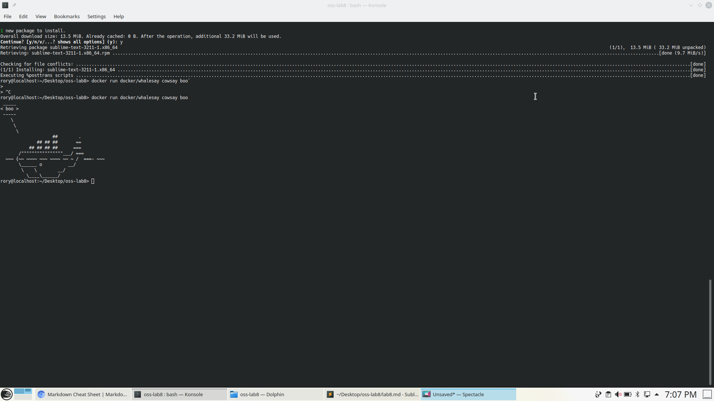

## Example 01

### Playing with new container:

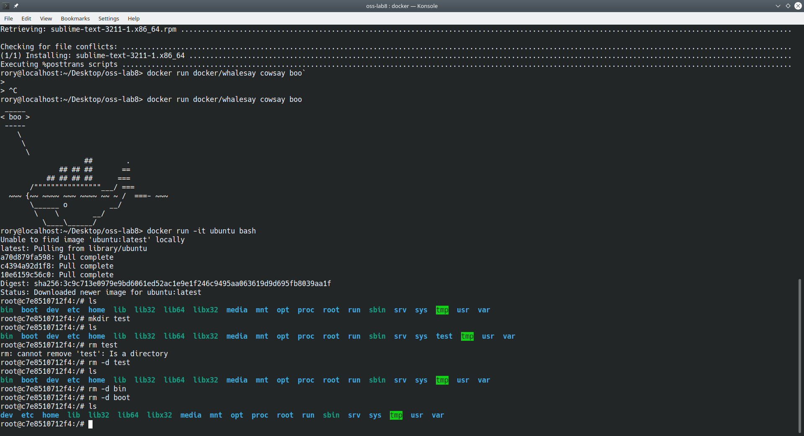

### Using Vim:


### Cowsay:

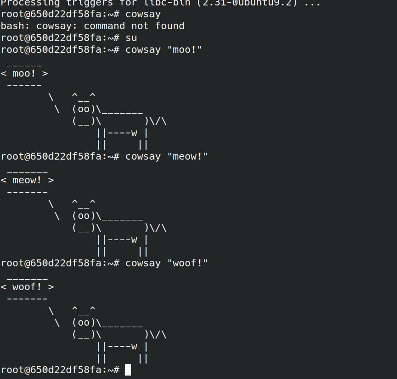

## Example 02

### Rocket Chat working in browser:

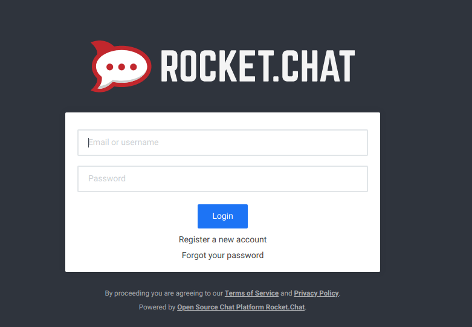

### Successfully made a Rocket Chat Account:

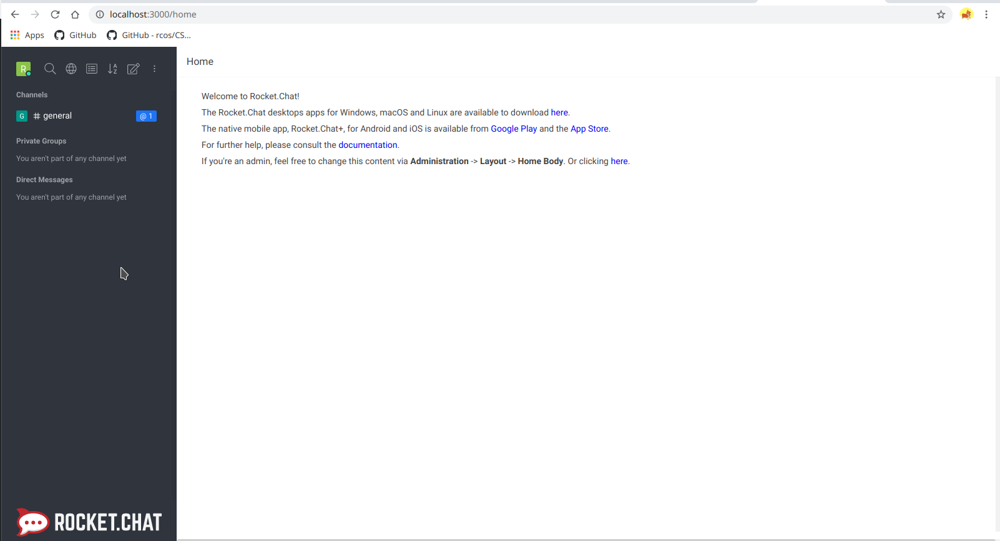

### Listed out containers, stopped them, and saw that they were deleted:

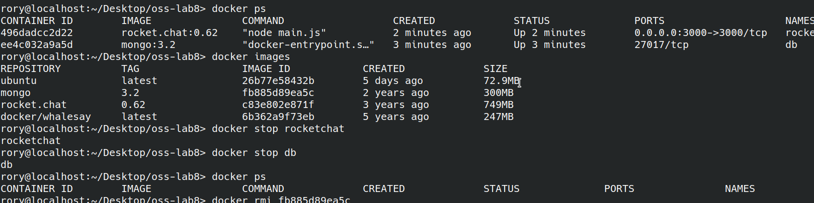

### Here, I tried to remove the images, but I realized I hadn't removed the containers yet. After removing them, I was able to remove the mongo image:

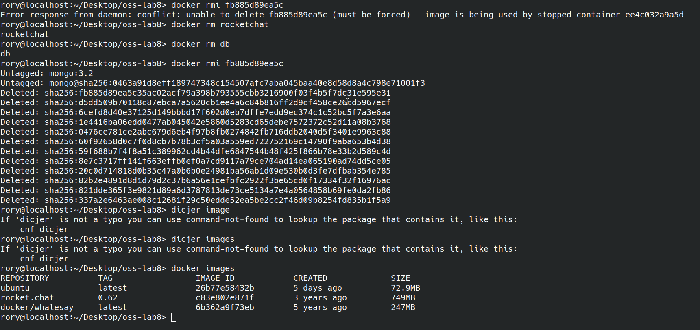

## Example 3:

### Building the Docker Container:

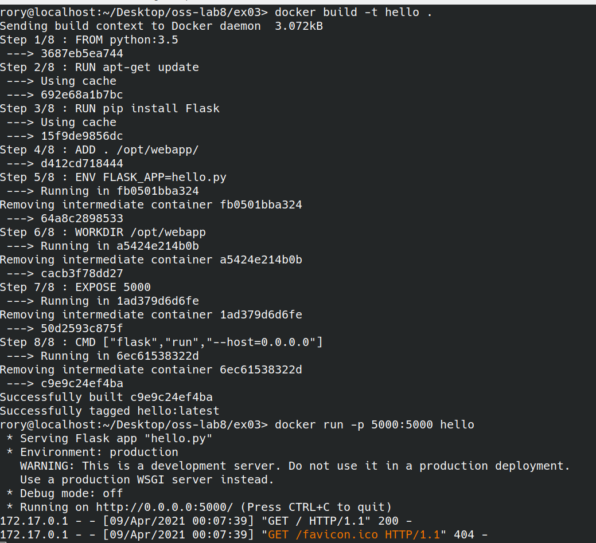

### Showing it in the browswer:

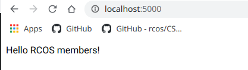

### Docker File:

```
# base image:
FROM python:3.5

# First Instruction:
RUN apt-get update

# Install Python packages
RUN pip install Flask

# Add file to the container:
ADD . /opt/webapp/

# Add environment variable:
ENV FLASK_APP=hello.py

# Set the working directory for our container:
WORKDIR /opt/webapp

# Expose the port:
EXPOSE 5000

# Run the application:
CMD ["flask","run","--host=0.0.0.0"]

```

### Hello World file:

```
from flask import Flask
app = Flask(__name__)

@app.route("/")
def hello():
    return "Hello RCOS members!"

if __name__ == "__main__":
    app.run()
```

## Example 4:

### Trying to run the app:

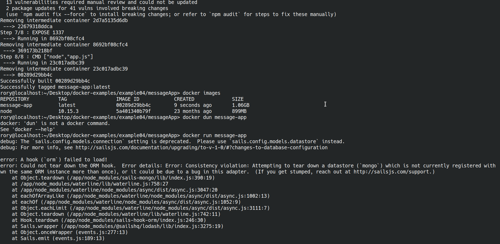

### Docker file:

```
# Use node 10.15.3 LTS
FROM node:10.15.3
ENV LAST_UPDATED 20190325T175400

# Copy source code
COPY . /app

# Change working directory
WORKDIR /app

# Install dependencies
RUN npm install

# Fix up some of the issues
RUN npm audit fix

# Expose API port to the outside
EXPOSE 1337

# Launch application
CMD ["node","app.js"]
```

### Compose File:

```
version: '3'
services:
  mongo:
    image: mongo:4.0.7
    volumes:
      - mongo-data:/data/db
    expose:
      - "27017"
  app:
    build: .
    ports:
            - "1337:1337"
    links:
      - mongo
    depends_on:
      - mongo
    environment:
      - MONGO_URL=mongodb://mongo/messageApp
volumes:
  mongo-data:
```

### Server Running:

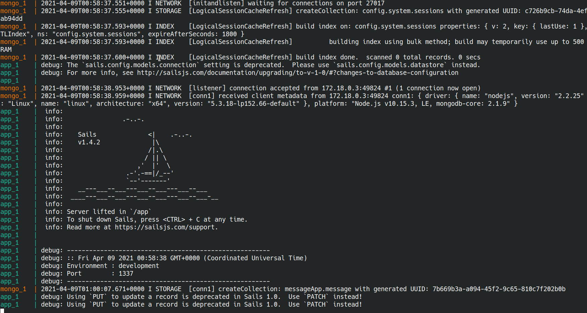

### Chat Working:

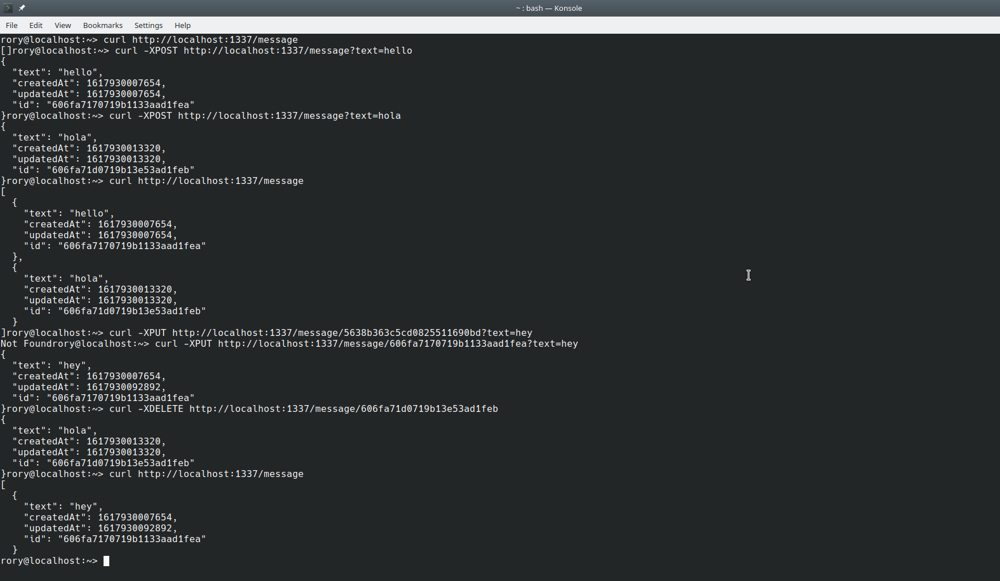