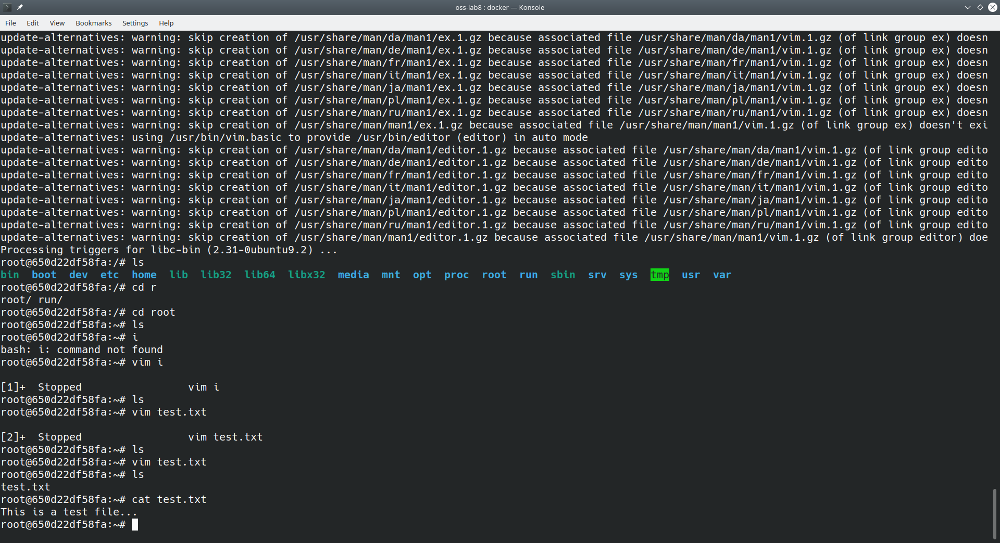

## Example 00

### Proof of Docker Installation: 

## Example 01

### Playing with new container:

### Using Vim:

### Cowsay:

## Example 02

### Rocket Chat working in browser:

### Successfully made a Rocket Chat Account:

### Listed out containers, stopped them, and saw that they were deleted:

### Here, I tried to remove the images, but I realized I hadn't removed the containers yet. After removing them, I was able to remove the db image:

